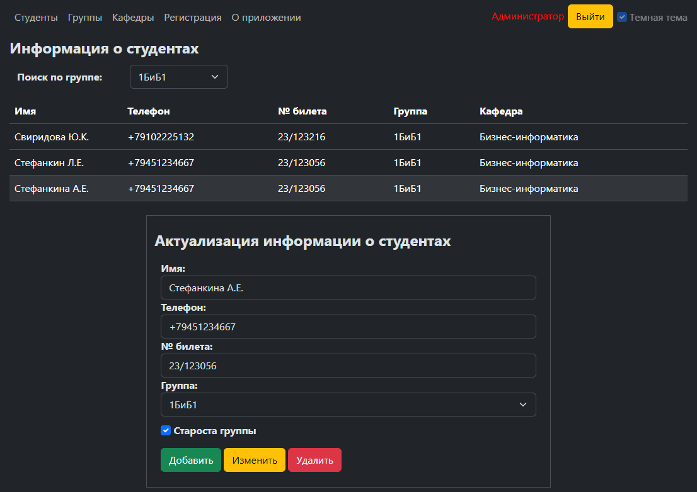

# StudentFlaskApp - веб-приложение на основе фреймворка Flask  

Веб-приложение предназначено для организации взаимодействия со студентами вуза. Основными функциями приложения являются добавление, удаление и изменение информации о студентах, студенческих группах и кафедрах вуза.

- [Установка](#установка)
- [Запуск](#запуск)

## Установка
Для установки приложения необходимо выполнить следующие действия:
- Создать БД Students в СУБД SQL Server (students.sql)
- Клонировать репозиторий GitHub в любую папку, например, StudentFlaskApp
 ```bash
git clone https://github.com/ivinokurov/StudentsFlask.git StudentFlaskApp
```
- Перейти в папку StudentFlaskApp
 ```bash
cd StudentFlaskApp
```
- Установить пакеты Python из файла requirements.txt
 ```bash
pip install -r requirements.txt
```

## Запуск
Ввести в строке поиска веб-браузера следующий URL:
```bash
http://127.0.0.1:5050
```
Ввести имя и пароль для входа администратора или обычного пользователя - admin, admin или user, user соответсвенно.

<p align="center" width="100%" style="text-align: center;">
    
    <i>Окно для входа нового пользователя</i>
</p>
</p>

После входа вы будуте перенаправлены на страницу со списком студентов. Дальнейшая работа с веб-приложением является интуитивно понятной.

<p align="center" width="100%" style="text-align: center;">
    
    <i>Страница со списком студентов</i>
</p>
